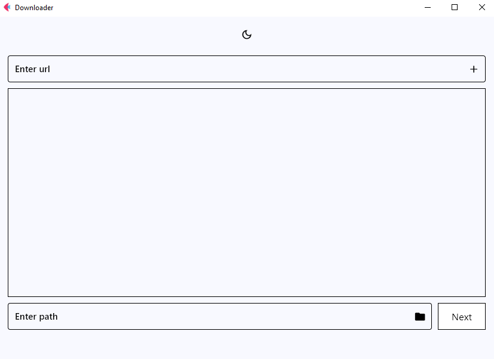
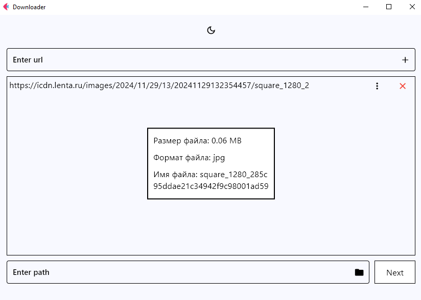
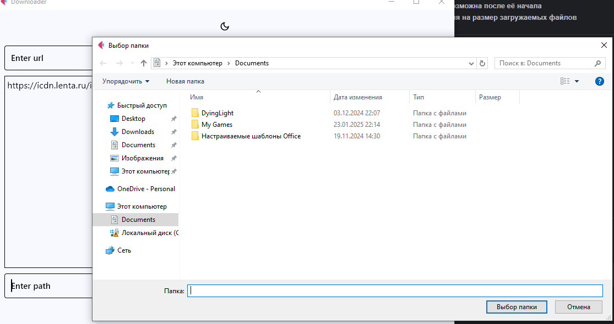
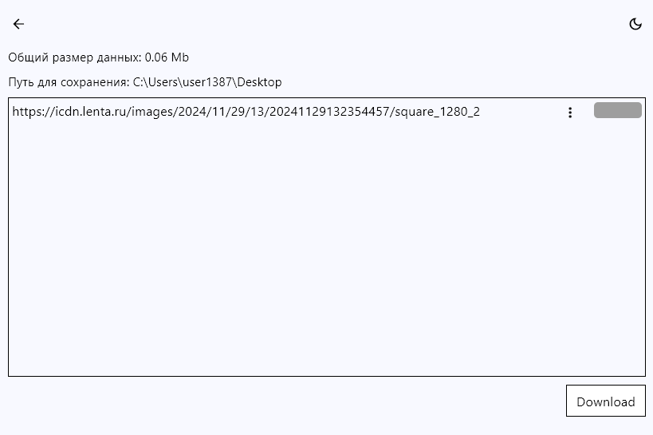

# 🔽 Downloader

## 📌 Описание проекта
**Downloader** — это многопоточный загрузчик файлов с графическим интерфейсом на **Flet**.  
Поддерживает скачивание **любых файлов по всем типам ссылок** (HTTP, HTTPS, FTP и другие).

---

## 🚀 Функциональность
- 🔗 **Поддержка всех типов ссылок** (HTTP, HTTPS, FTP и др.)
- 🔄 **Многопоточная загрузка** для увеличения скорости скачивания
- 📂 **Выбор папки сохранения** перед началом загрузки
- 📊 **Отображение прогресса загрузки** с возможностью просмотра деталей файла (размер, формат, имя)
- ❌ **Остановка загрузки невозможна после её начала**
- ✅ **Отсутствуют ограничения на размер загружаемых файлов**

---

## 📂 Скриншоты функционала

### 🖥️ Главное окно


###  Дополнительная информация по файлу


### 📂 Выбор папки для сохранения


###  Страница загрузки


### 📥 Процесс загрузки


---

## 📂 Структура проекта
```plaintext
Downloader/
│── help_func/         # Вспомогательные модули
│   ├── Data_content.py
│   ├── detect_format.py
│   ├── File_management.py
│── main.py            # Точка входа в приложение
│── README.md          # Этот файл
```
---

## 🔧 Установка и запуск

### Клонирование репозитория
```sh
git clone https://github.com/viyalimo/Downloader.git
cd Downloader
```
--- 

## 🛠 Используемые библиотеки
- **Flet — для графического интерфейса**
- **Requests — для скачивания файлов**
- **ThreadPoolExecutor — для многопоточной загрузки**
---

## 📞 Контакты
Если у вас есть вопросы или предложения, свяжитесь со мной через GitHub.

### 🚀 Развивайте проект и используйте его на здоровье! 😊

